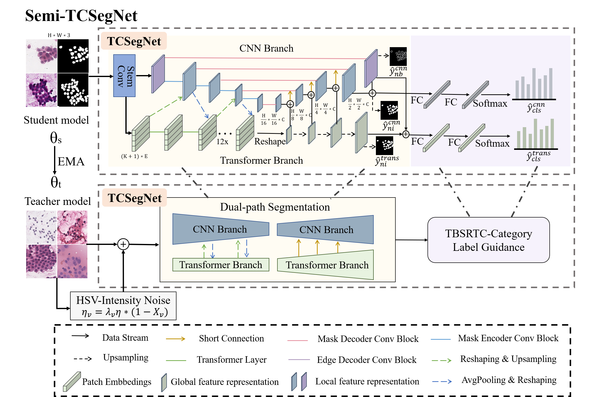
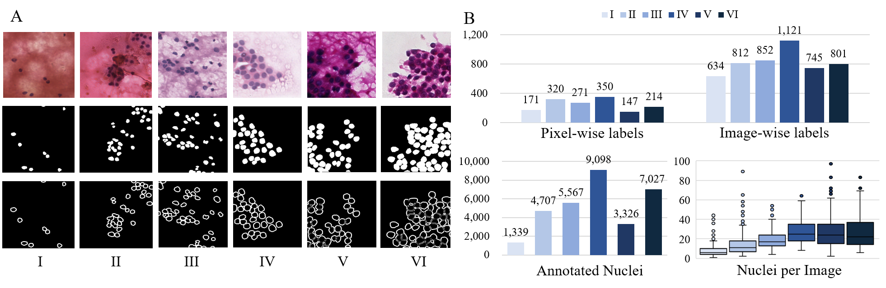
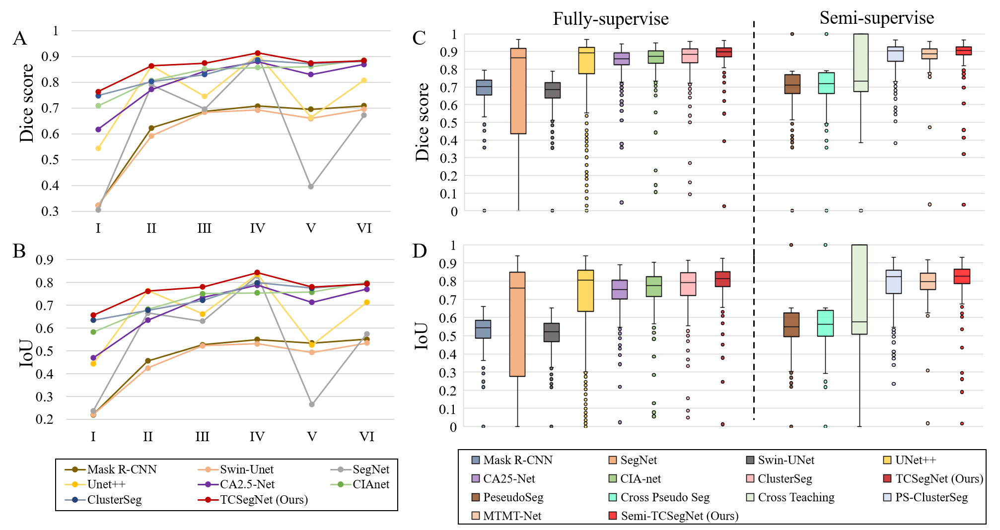

## TCSegNet：An Anti-Biased TBSRTC-Category Aware Nuclei Segmentation Framework with A Multi-Label Thyroid Cytology Benchmark

This project consists of models of our newly-proposed TCSegNet and its semi-supervised extension, which was accepted by MICCAI 2023.



## Motivation and Contribution

Two major challenges hinder accurate nuclei segmentation from thyroid cytology. Firstly, unbalanced distribution of nuclei morphology across different TBSRTC categories can lead to a biased model. Secondly, the insufficiency of densely annotated images results in a less generalized model. In contrast, image-wise TBSRTC labels, while containing lightweight in formation, can be deeply explored for segmentation guidance. 

To solve these two issues, we propose a novel TBSRTC-category-aware nuclei segmentation framework. Our contributions are three-fold:

- Help reduce bias in the learning process of the segmentation model with the routine unbalanced training set.

- Leverage image-wise labels in a semi-supervised learning manner, which significantly reduces the reliance on annotation-intensive pixel-wise labels.
- First publicized thyroid cytopathology dataset of both image-wise and pixel-wise labels.

## Dataset

In this program, we establish a dataset of thyroid cytopathology image patches of 224 × 224, namely TCdata, where 4,965 image labels are provided following TBSRTC, and 1,473 of them are densely annotated. The profile and  structure of dataset are shown below. You can get TCdata by downloading `TCdata.zip`.

```
TCdata/
├── train/
│   ├── Images/
│   │   └── 1.png
│   ├── Masks/
│   │   └── 1.png
│   ├── EdgeMasks/
│   │   └── 1.png
│   └── img/
│   │   ├── 1
│   │   └── 2
└── test/
    └── Images/
        └── 1.png
```



## TCSegNet and Semi-TCSegNet 

1. To train `TCSegNet` on your own dataset, run

```
python train.py --root_path '' --max_iterations 10000 --base_lr 0.005 --gpu '' --cls 1
```

Note: `cls` is the weight for classification loss.

2. To train `Semi-TCSegNet` on your own dataset, run

```
python semi-train.py --root_path '' --batch_size 8 --labeled_bs 6 --max_iterations 10000 --base_lr 0.005 --gpu '' --cls 1 --edge 1 --consistency 1
```

Note: `labeled_bs` is the number of labelled images you want in one iteration. When you set batch_size and labeled_bs as 8 and 6, it means 6 labelled images and 2 unlabelled images trained in one iteration. `edge` and `consistency` are the weight of boundary loss and consistency loss.

3. To validate, run

```
python test.py --root_path ''
```

##  Experiment

We tested our dataset on multiple models and provided a list of baselines here.

1. **Fully-supervised**

|       Method        |   Dice    |    IoU    |
| :-----------------: | :-------: | :-------: |
|     Mask R-CNN      |   0.657   |   0.500   |
|      Swin-Unet      |   0.671   |   0.516   |
|       SegNet        |   0.676   |   0.587   |
|       UNet++        |   0.784   |   0.691   |
|      Ca2.5-Net      |   0.838   |   0.732   |
|       CIA-Net       |   0.854   |   0.775   |
|     ClusterSeg      |   0.857   |   0.761   |
| **TCSegNet (Ours)** | **0.877** | **0.788** |

2. **Semi-supervised**

|          Method          | Dice  |  IoU  |
| :----------------------: | :---: | :---: |
|        PseudoSeg         | 0.734 | 0.612 |
|     Cross Pseudo Seg     | 0.737 | 0.618 |
|      Cross Teaching      | 0.795 | 0.704 |
|      PS-ClusterSeg       | 0.866 | 0.775 |
|         MTMT-Net         | 0.878 | 0.789 |
| **Semi-TCSegNet (Ours)** | 0.889 | 0.805 |



## Citation

If you find this project useful for your research, please use the following BibTeX entry.

```
@inproceedings{zhu2023anti,
  title={An Anti-biased TBSRTC-Category Aware Nuclei Segmentation Framework with a Multi-label Thyroid Cytology Benchmark},
  author={Zhu, Junchao and Shen, Yiqing and Zhang, Haolin and Ke, Jing},
  booktitle={International Conference on Medical Image Computing and Computer-Assisted Intervention},
  pages={580--590},
  year={2023},
  organization={Springer}
}
```

